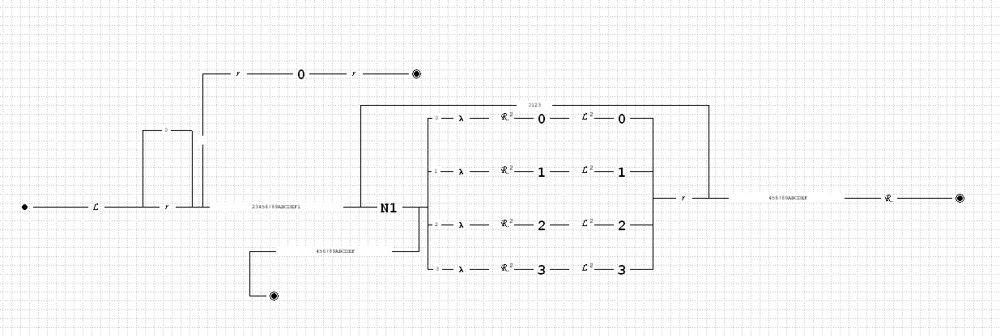
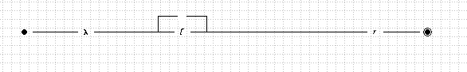
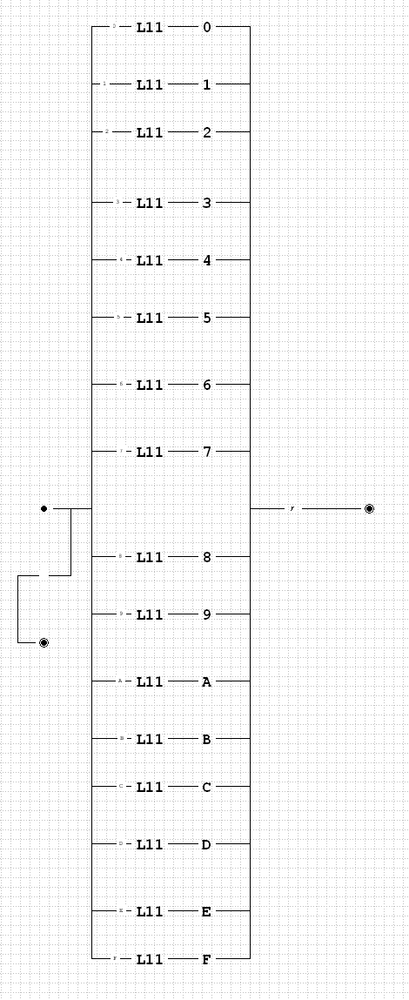
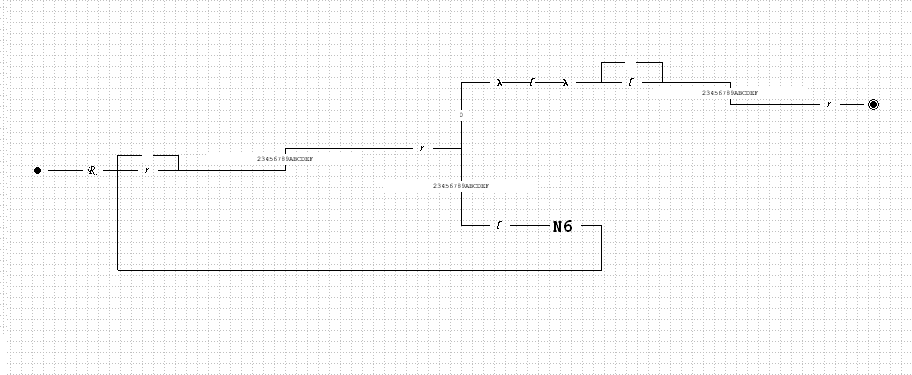
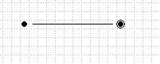
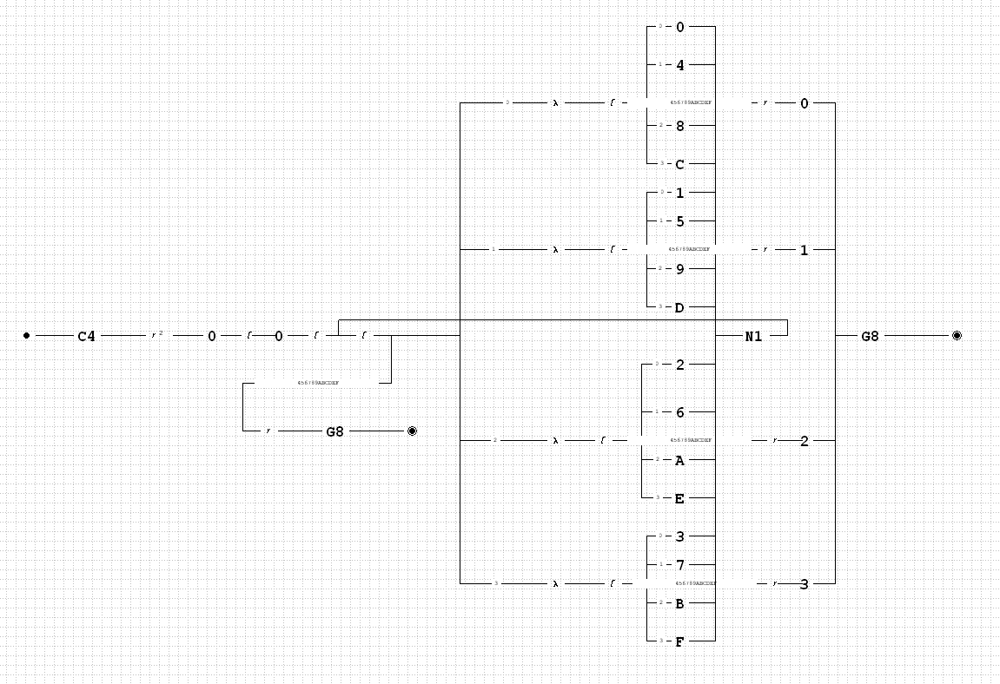

# Отчет по лабораторной работе № 6
## по курсу "Фундаментальная информатика"

Студент группы М8О-108Б-23 Власко Михаил Михайлович

Работа выполнена

Преподаватель: каф. 806 Севастьянов Виктор Сергеевич

1. **Тема**: Конструирование диаграмм Тьюринга
2. **Цель работы**: Разработать диаграмму Тьюринга решения представленной ниже задачи в среде интерпретатора 
Virtual Turing 2.0.
3. **Задание (вариант №6)**: Перевод числа из четверичной системы счисления в шестнадцатеричную (линейная сложность).
4. **Идея, метод, алгоритм решения задачи**:
    - В первую очередь реализуемый диаграммой алгоритм должен скопировать введённое число. Несмотря на то что имеется
встроенная машина копирования К, целесообразнее реализовать отдельную машину, которая скопирует число без значащих нулей.
    - После копирования алгоритм будет проходить копию числа справа налево, зачищая каждые 2 цифры четверичной записи и 
заменяя их на соответствующую цифру шестнадцатеричной записи.
    - В конечном счёте от копии числа останутся разделённые пробелами шестнадцатеричные цифры, которые нужно записать 
подряд, после чего ответ будет получен.
   5. **Сценарий выполнения работы**:
       1. Машина копирования COPY (C4) пройдёт всё число влево до пробела, затем продвинется вправо до первой значащей цифры,
   пропустив ведущие нули, затем затрёт первую значащую цифру, продвинется вправо до конца числа, запишет цифру после
   первого пробела, вернётся на затёртое место, вернёт скопированную цифру, сдвинется вправо, затрёт очередную цифру и 
   продолжит таким образом копирование, пока не дойдёт до конца входного числа. После завершения копирования курсор 
   к правому краю копии.
      2. Далее в конец копии будет установлены два 0, которые потребуется для остановки алгоритма в дальнейшем. Затем 
каретка сместится влево до последней цифры копии числа, затрёт её, сместиться ещё на шаг влево и затрёт предпоследнюю 
цифру копии. Затем, с учётом двух затёртых цифр, на место предпоследней цифры будет установлена соответствующая им 
шестнадцатеричная цифра. После этого ещё сдвиг влево и аналогичное считывание очередных двух цифр.
      3. Если в числе нечётное количество цифр, первая слева числа цифра в шестнадцатеричной системе равна самой себе и 
не изменяется. 
      4. После завершения описанной выше обработки каретка сдвигается с первой слева цифры (двух подряд цифр, если 
количество цифр в исходном числе было нечётным) вправо до первой обособленной цифры, затирает её, возвращается влево и 
записывает затёртую цифру вплотную к первой(ым). Таким образом, все обособленные цифры записываются вплотную друг к другу.
      5. Когда каретка в качестве очередных обособленных чисел находит два ранее установленных 0 подряд,
они затираются, и каретка возвращается к правому правому краю получившегося шестнадцатеричного числа, на чём выполнение 
алгоритма завершается.

### Использованные машины
###### Машина **COPY** (C4)

###### Машина **lambda-left** (L11)

- Данная машина используется в машине **normal** для реализации однотипной операции смещения влево для 16 различных 
состояний.

###### Машина **normal** (N6)

- Машина реализует чтение очередной "обособленной" цифры (см. п. d), смещения влево по пробелам и записи прочтённой цифры 
вплотную к числу.

###### Машина **normalize** (N9)

- Машина реализует описанную в пп. d-e группировку шестнадцатеричных цифр в окончательный результат.

###### Машина **n** (N1)

- Машина холостого хода, используется для более удобного изображения на диаграмме выходных связей большого числа
параллельных машин, когда после выполнения какой-либо из них идёт возврат к циклу без какого-либо общего действия.

###### Основная машина

### Правила перевода очередных двух четверичных цифр в одну шестнадцатеричную

| '16' | '4' |
|------|:---:|
| 0    | 00  |
| 1    | 01  |
| 2    | 02  |
| 3    | 03  |
| 4    | 10  |
| 5    | 11  |
| 6    | 12  |
| 7    | 13  |
| 8    | 20  |
| 9    | 21  |
| A    | 22  |
| B    | 23  |
| C    | 30  |
| D    | 31  |
| E    | 32  |
| F    | 33  |

### Протокол тестирования
| Входные данные |  Выходные данные  | Описание тестируемого случая                                |
|----------------|-------------------|-------------------------------------------------------------|
| 0 0            | 0 0 0             | Тест 1 (Краевой случай "0 0")                               |
| 1 1            | 1 1 1             | Тест 2 (Краевой случай "1 1")                               |
| 010 101        | 010 101 000       | Тест 3 (Комбинация с полностью нулевым выводом)             |
| 1111 1010      | 1111 1010 1010    | Тест 4 (Сохранение ВЧ в неизменном виде)                    |
| 000 111        | 000 111 000       | Тест 5 (Полное обнуление ВЧ нулевой маской)                 |
| 111 000        | 111 000 000       | Тест 6 (Сохранение полностью нулевого ВЧ в неизменном виде) |
| 10110 11101    | 10110 11101 10100 | Тест 7 (Случайная комбинация)                               |

6. **Листинг**: 
Проект диаграммы в формате **.jdtp** находится в файле [6.jdtp](6.jdtp).
7. **Замечания автора** по существу работы: Основной трудностью при разработке алгоритма стала необходимость 
"запоминания" копируемой или анализируемой цифры с помощью создания дополнительных состояний (ввиду отсутствия у машины 
Тьюринга какой-либо другой памяти). В связи с этим, уже при наличии в алфавите лишь двух знаков (0 и 1), количество 
необходимых для "запоминания" очередного символа состояний увеличивается по сравнению с однознаковым алфавитом 
в 2 - 4 раза.
8. **Выводы**: Разработан алгоритм выделения разрядов второго двоичного числа по маске, заданной первым числом, 
составлена соответствующая программа Машины Тьюринга в четвёрках. Получен практический опыт работы с абстрактным 
исполнителем Машина Тьюринга, написания алгоритма обработки двоичных чисел на языке предельно низкого уровня.
